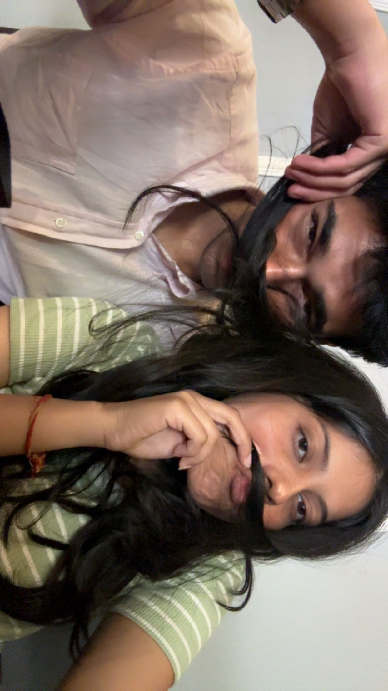

# Type-my-gift.-
<!DOCTYPE html>
<html lang="en">
<head>
    <meta charset="UTF-8">
    <meta name="viewport" content="width=device-width, initial-scale=1.0">
    <title>A Special Surprise</title>
    
</head>
<body>

    

        <h1>Happy Birthday! 🎂</h1>
        
❤️

        
        
        
        
I wanted to make something unique just for you. You're the best problem solver I know, and I'm so lucky to have you!

        

        
I hope your day is as amazing as you are. I can't wait to see you soon!

        
✨🎁✨

    

</body>
</html>
